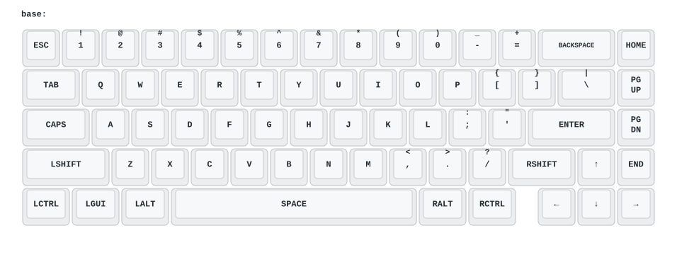

# Owlab LINK65 ZMK Firmware

[English](README.md)

Owlab LINK65 핫스왑 PCB를 위한 유선 ZMK 펌웨어입니다. 공장 출하 DFU
부트로더를 유지한 채 ZMK를 `0x08006000`부터 실행합니다.

**이 펌웨어는 U3에 `APM32F103CBT6`가 장착된 LINK65 핫스왑 PCB에서만
실기기 검증되었습니다. 솔더 PCB, 다른 리비전 또는 MCU가 다른 기판에는
플래시하지 마십시오.**

## 주요 특징

- USB 유선 키보드와 65% ANSI 67키 배열 지원
- 공장 DFU 부트로더와 물리 **B** 버튼을 그대로 사용
- 공장 펌웨어와 동일한 active-low 행 스캔 및 열 입력 방식 적용
- LINK65에서 확인된 30 us 매트릭스 안정화 시간 적용
- PA15 키 입력을 사용하도록 JTAG만 해제하고 SWD 핀은 유지
- GitHub Actions를 통한 재현 가능한 ZMK 펌웨어 빌드

이 PCB에는 무선 하드웨어가 없으므로 Bluetooth는 지원하지 않습니다. 현재
펌웨어에는 ZMK Studio, 영구 설정 저장소, RGB/조명 제어도 포함되어 있지
않습니다.

## 지원 대상

| 항목 | 확인된 구성 |
| --- | --- |
| 키보드 | Owlab LINK65 핫스왑 PCB |
| MCU | Geehy `APM32F103CBT6` |
| 호환 SoC 설정 | Zephyr `STM32F103xB` |
| 플래시 / SRAM | 128 KiB / 20 KiB |
| 시스템 클럭 | 8 MHz HSE, 72 MHz CPU, 48 MHz USB |
| 키 매트릭스 | 5행 × 15열, 67개 스위치 |
| 연결 방식 | USB Full-Speed |
| DFU 장치 | `1688:2220`, alternate setting 0 |

기판의 U3 마킹이 위와 다르면 진행하지 마십시오. 같은 LINK65라는 이름만으로
PCB와 플래시 레이아웃이 같다고 가정할 수 없습니다.

## 빠른 설치

### Windows 원클릭 플래셔

1. [최신 GitHub Release](https://github.com/thsrhwk01/zmk-Owlab_Link/releases/latest)를 엽니다.
2. `LINK65-ZMK-Windows.zip`을 내려받고 파일을 모두 압축 해제합니다.
3. `flash-link65.cmd`를 더블 클릭합니다.
4. LINK65 핫스왑 PCB와 U3의 `APM32F103CBT6`를 확인한 뒤 경고 질문에 `y`를
   입력합니다. `n` 또는 빈 입력은 아무것도 기록하지 않고 취소합니다.
5. 안내가 나오면 PCB의 물리 **B** 버튼을 누른 채 USB를 연결하고 버튼에서
   손을 뗍니다. 스크립트가 올바른 DFU 장치를 기다렸다가 검증된 펌웨어를
   자동으로 플래시합니다.
6. `Flash complete`가 표시되면 USB를 분리한 뒤, **B** 버튼을 누르지 않고
   다시 연결합니다.

공장 부트로더는 자동 DFU 종료 요청에 안정적으로 응답하지 않습니다. 따라서
플래셔는 기록 성공 후 DFU 모드에 그대로 두고 USB를 직접 다시 연결하도록
안내합니다.

Windows에서 처음 사용할 때 DFU 인터페이스 `1688:2220`에 WinUSB 드라이버를
연결해야 할 수 있습니다. 플래셔가 키보드를 찾지 못하면 ZIP에 포함된
`README_KO.txt`를 따르십시오. 관계없는 USB 장치의 드라이버는 변경하지
마십시오.

`main`이 아닌 브랜치도 펌웨어 빌드가 성공할 때마다 Actions에
`LINK65-ZMK-Windows` artifact가 생성됩니다. 바로 사용할 수 있는 ZIP이 첨부된
GitHub Release는 `v1.0.0` 같은 버전 태그를 push할 때만 게시됩니다.

### 수동 설치

#### 1. 펌웨어 받기

1. [최신 GitHub Release](https://github.com/thsrhwk01/zmk-Owlab_Link/releases/latest)를 엽니다.
2. `owlab_link_hotswap-zmk.bin`과 `SHA256SUMS.txt`를 내려받습니다.
3. 필요하면 플래시 전에 해시를 확인합니다.

   ```powershell
   Get-FileHash .\owlab_link_hotswap-zmk.bin -Algorithm SHA256
   ```

아직 Release가 없다면
[Build and Release ZMK firmware](https://github.com/thsrhwk01/zmk-Owlab_Link/actions/workflows/build.yml)의
최근 성공 실행에서 `firmware` artifact를 내려받아 압축을 풉니다.

현재 실기기 검증 기준은
[commit `2a8cde7`](https://github.com/thsrhwk01/zmk-Owlab_Link/commit/2a8cde7fc346bc73e935f38bb52aeee44a7fb05f),
[Actions run `31102550907`](https://github.com/thsrhwk01/zmk-Owlab_Link/actions/runs/31102550907)입니다.

#### 2. 준비하기

- 데이터 전송이 가능한 USB 케이블
- [`dfu-util`](https://dfu-util.sourceforge.net/)
- 문제가 생겼을 때 되돌릴 수 있는 LINK65 핫스왑용 공식 Vial/VIA `.bin`

다음 명령이 실행되는지 먼저 확인합니다.

```console
dfu-util --version
```

#### 3. 공장 DFU 부트로더로 들어가기

1. 키보드의 USB 케이블을 분리합니다.
2. PCB의 물리 **B** 버튼을 누른 채 USB 케이블을 연결합니다.
3. **B** 버튼에서 손을 뗍니다.
4. 다음 명령으로 장치를 확인합니다.

```console
dfu-util -l
```

출력에 USB ID `1688:2220`과 alternate setting 0이 모두 보여야 합니다. 다른
장치만 보이거나 아무 장치도 보이지 않으면 플래시하지 마십시오.

#### 4. ZMK 플래시하기

펌웨어가 있는 폴더에서 다음 명령을 실행합니다.

```console
dfu-util -d ,1688:2220 -a 0 -s 0x08006000 -D owlab_link_hotswap-zmk.bin
```

`File downloaded successfully`가 표시되면 USB를 분리하고 **B** 버튼을 누르지
않은 채 다시 연결합니다. 키보드가 `Owlab Link` USB 키보드로 시작해야 합니다.

> [!CAUTION]
> `0x08000000`에 애플리케이션을 쓰거나 MCU를 mass erase하지 마십시오.
> 공장 부트로더를 지우면 USB DFU만으로는 복구할 수 없습니다. 이 저장소의
> 펌웨어는 항상 `0x08006000`에 플래시해야 합니다.

## 키맵

기본 키맵은 일반적인 ANSI 65% QWERTY 배열입니다. 원본은
[`boards/arm/owlab_link_hotswap/owlab_link_hotswap.keymap`](boards/arm/owlab_link_hotswap/owlab_link_hotswap.keymap)에서
수정할 수 있습니다.



이 다이어그램은 [keymap-drawer](https://github.com/caksoylar/keymap-drawer)가
`.keymap` 원본에서 생성하며, 키맵이 바뀌면 자동으로 갱신됩니다.

| 입력 | 동작 |
| --- | --- |
| `Left Ctrl + Left Alt + Backspace` | ZMK 소프트 리셋 |
| 물리 **B** 버튼을 누른 채 USB 연결 | 공장 DFU 부트로더 진입 |

소프트 리셋은 애플리케이션만 다시 시작하며 DFU 부트로더로 들어가지 않습니다.
펌웨어를 업데이트할 때는 물리 **B** 버튼을 사용하십시오.

키맵을 변경하려면 이 저장소를 fork한 뒤 `.keymap` 파일을 수정하고 push합니다.
GitHub Actions가 `owlab_link_hotswap-zmk.bin`과 `LINK65-ZMK-Windows` 원클릭
플래셔 artifact를 자동으로 빌드합니다. `main`을 포함한 일반 push는 GitHub
Release를 게시하지 않습니다.

## Release 게시하기

배포할 커밋을 `main`에 병합하고 Actions 빌드 성공을 확인한 뒤 annotated 버전
태그를 만들어 push합니다.

```console
git switch main
git pull --ff-only
git tag -a v1.0.0 -m "Release v1.0.0"
git push origin v1.0.0
```

`v*.*` 형식과 일치하는 태그를 push할 때만 펌웨어, 체크섬과 Windows 플래셔
ZIP이 Release에 게시됩니다. `v1.1.0-beta.1`처럼 문자가 들어간 태그는
prerelease가 되고, 숫자로만 된 일반 버전은 최신 안정 Release가 됩니다.

## Vial/VIA로 되돌리기

물리 **B** 버튼으로 DFU에 들어갈 수 있다면 공장 펌웨어로 되돌릴 수 있습니다.
LINK65 핫스왑 PCB용으로 확인된 공식 `.bin`을 준비하고 같은 애플리케이션
주소에 플래시합니다.

```console
dfu-util -d ,1688:2220 -a 0 -s 0x08006000 -D owlab_link_hotswap_via_V3.bin
```

파일 이름은 보유한 공식 펌웨어에 맞게 바꾸십시오. 다운로드가 성공하면
**B** 버튼을 누르지 않고 USB를 분리했다가 다시 연결합니다. 다른 LINK65
리비전의 펌웨어를 대신 사용하지 마십시오.

## 플래시 후 확인

처음 설치한 뒤 다음 항목을 확인하십시오.

1. 운영체제에서 USB HID 키보드로 정상 인식되는지 확인합니다.
2. 키 테스터로 67개 위치를 모두 한 번씩 누릅니다.
3. 키 하나를 눌렀을 때 오른쪽 키가 함께 입력되지 않는지 확인합니다.
4. USB를 완전히 분리했다가 세 번 다시 연결해 봅니다.
5. 물리 **B** 버튼으로 DFU에 다시 들어갈 수 있는지 확인합니다.

PA15를 사용하는 마지막 매트릭스 열과 `Esc`, `F`, `G` 주변은 특히 확인하는
것이 좋습니다.

## 알려진 제한 사항

- ZMK Studio를 통한 런타임 키맵 편집은 아직 지원하지 않습니다.
- 설정 저장용 플래시 파티션을 만들지 않았습니다.
- RGB 및 기판 고유 부가 기능은 구현하지 않았습니다.
- 소프트웨어를 통한 공장 DFU 진입은 구현하지 않았습니다.
- 기본 키맵은 한 개 레이어만 제공합니다.

STM32F103/APM32F103 계열의 다른 기판을 ZMK로 포팅하려는 개발자는
[`docs/porting-guide_ko.md`](docs/porting-guide_ko.md)를 먼저 읽으십시오. LINK65의
플래시 맵을 다른 기판에 그대로 복사하면 안 됩니다.
